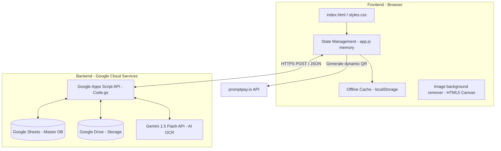
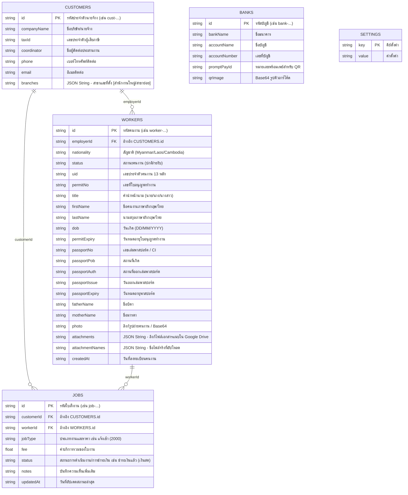

# WorkerOS - System Architecture & Development Guide

เอกสารนี้ระบุรายละเอียดทางสถาปัตยกรรมโครงสร้างระบบ (System Architecture) ตารางฐานข้อมูล (Database Schema) และแนวทางการพัฒนา (Development Guidelines) ของระบบ **WorkerOS** เพื่อให้การแก้ไข ปรับปรุง และพัฒนาระบบหลังจากนี้เป็นไปอย่างเป็นระบบ ระเบียบ และมีมาตรฐานเดียวกันสำหรับนักพัฒนาทุกคน

---

## 1. แผนผังโครงสร้างการทำงาน (System Architecture Overview)

ระบบใช้สถาปัตยกรรมแบบ **Hybrid Single-Page Application (SPA) with Serverless Backend** โดยข้อมูลหน้าบ้านจะรันแบบออฟไลน์ผ่านเบราว์เซอร์ก่อนจะทำการเชื่อมต่อเพื่อซิงโครไนซ์ข้อมูลแบบเรียลไทม์กับ Google Sheets ในลักษณะ API:



---

## 2. โครงสร้างฐานข้อมูล (Database Schema - Google Sheets Tabs)

ข้อมูลทั้งหมดจะถูกจัดเก็บในตารางหลักบน Google Sheets โดยแยกเป็น **5 แผ่นงาน (Tabs)** ที่มีจุดเชื่อมโยงความสัมพันธ์ของข้อมูล (Foreign Keys) ดังต่อไปนี้:



---

## 3. สรุปโมดูลการประมวลผลหลัก (Core Modules & Flow)

### 3.1 การจัดเก็บและซิงค์ข้อมูล (Data Sync Flow)
* **การบันทึก (Save/Edit)**: หน้าเว็บจะเขียนข้อมูลลงในสถานะของหน่วยความจำเครื่อง และเขียนบันทึกแคชลง `localStorage` ก่อนส่ง HTTP POST Request ไปที่ Google Apps Script เพื่อบันทึกลงในแถวตารางสเปรดชีต
* **สิทธิ์การใช้งาน (Permissions)**: มีระบบแบ่งแยกสิทธิ์ตามบทบาทผู้ใช้ (Role-based) ได้แก่:
  * `admin`: สิทธิ์เต็มรูปแบบ
  * `manager`: สิทธิ์เขียน/แก้ไขข้อมูลหลักและข้อมูลการเงิน
  * `staff`: สิทธิ์เข้าดูข้อมูลได้อย่างเดียว (Read-only) ไม่สามารถแก้ไข คลี่ หรือย้ายใบงานการเงินได้
  * `client`: สิทธิ์เฉพาะกลุ่ม ดูรายละเอียดคนงานและใบงานของตัวเอง

### 3.2 โมดูลตัดแต่งภาพพื้นหลังคนงาน (Photo Background Removal)
* โปรแกรมควบคุมการแก้ไขภาพผ่าน HTML5 Canvas โดยจะสแกนพิกเซลขอบรอบนอกของพอร์ตเทรต เพื่อหาเฉดสีพื้นหลังหลัก และใช้ค่าความต่างระยะห่างเฉดสี (Color Euclidean Distance) ในการกรองและล้างสีฉากหลังออก แปลงเป็นสีขาวล้วน `#FFFFFF` แบบอัตโนมัติ

### 3.3 โมดูลป้อนข้อมูลอัตโนมัติด้วย AI OCR (AI OCR Document Processing)
* เมื่อแนบไฟล์ PDF หรือรูปภาพ หน้าแอปจะประมวลผลส่งไฟล์ไปวิเคราะห์ผ่าน **Gemini 1.5 Flash API** ในคลาวด์ของ Apps Script 
* AI จะแปลงคำตอบกลับมาเป็นโครงสร้างข้อมูลมาตรฐาน (JSON) ซึ่งมีฟิลด์ `uid`, `firstName`, `passportNo`, `permitNo`, `permitExpiry` ฯลฯ และระบบจะป้อนค่าเข้าสู่ช่องรับข้อมูลของคนงานต่างด้าวโดยอัตโนมัติ

### 3.4 เครื่องคำนวณและยุบรวมบิล (Billing & Aggregation Engine)
* เมื่อกดยืนยันรวมบิลชุด (Combine Invoice) ระบบจะสแกนใบงานที่เลือก ค้นหารายการประเภทงานบริการที่ซ้ำกัน และทำการยุบรวมประเภทงานบริการเดียวกันมาแสดงในตารางใบเสร็จแถวเดียวกัน โดยตั้งยอดจำนวนคูณตามจำนวนคนงาน และใส่ลิสต์รายชื่อคนงานเรียงเลข 1, 2... ในตารางคำอธิบายอย่างสวยงาม

---

## 4. แนวทางการพัฒนาและควบคุมเวอร์ชัน (Development Guidelines)

เพื่อให้ระบบคงทน บำรุงรักษาได้ง่าย และพร้อมสำหรับการพัฒนาต่อยอด นักพัฒนาต้องปฏิบัติตามกฎดังนี้:

### 4.1 โครงสร้างไฟล์โค้ด (File Separation)
* `index.html`: ควบคุมเฉพาะส่วนโครงสร้างหน้าจอหลัก (HTML5 Semantic Elements) และโครงสร้าง Modals
* `styles.css`: ควบคุมสไตล์การแสดงผลทั้งหมดผ่านตัวแปรหลัก (Theme CSS Variables) ห้ามเขียนสไตล์แบบ Inline ในหน้า HTML โดยไม่จำเป็น
* `app.js`: ควบคุมการเก็บตัวแปร ฟังก์ชันคำนวณ ตรรกะประมวลผล และการเชื่อมต่อ API ทั้งหมด
* `Code.gs`: ควบคุมการทำงานฝั่งเซิร์ฟเวอร์ Google Sheets (การจัดแถว เขียนอ่านข้อมูล และการประมวลผลส่งไฟล์ขึ้น Google Drive / Gemini API)

### 4.2 มาตรฐานความปลอดภัย (Security Rules)
* **หลีกเลี่ยงการเปิดเผย API Key**: ห้ามใส่ Gemini API Key หรือความลับทางระบบลงในไฟล์ `app.js` หรือหน้าเว็บฝั่งหน้าบ้าน ให้ผูกเป็นตัวแปรแอบซ่อนในไฟล์ `Code.gs` ฝั่งหลังบ้านออนไลน์บน Google Apps Script เท่านั้น

### 4.3 แผนงานการใช้ Git (Git Workflow)
ทุกครั้งที่มีการอัปเดตระบบ ให้ควบคุมเวอร์ชันผ่านคำสั่ง Git ดังต่อไปนี้เสมอ:
1. ก่อนเริ่มเขียนโค้ดใหม่ ให้ตรวจสอบสถานะการอัปเดต: `git pull`
2. หลังการอัปเดตฟีเจอร์เสร็จสิ้น ให้บันทึกไฟล์:
   ```powershell
   git add .
   git commit -m "อัปเดต: [ระบุหัวข้อสิ่งที่คุณแก้ไขหรือเพิ่มเติม เช่น แก้ไขฟอนต์ใบเสร็จ]"
   ```
3. ส่งโค้ดขึ้นสู่ GitHub คลาวด์ออนไลน์: `git push`
